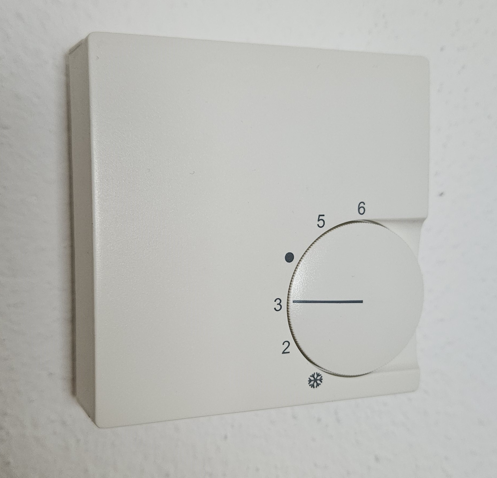
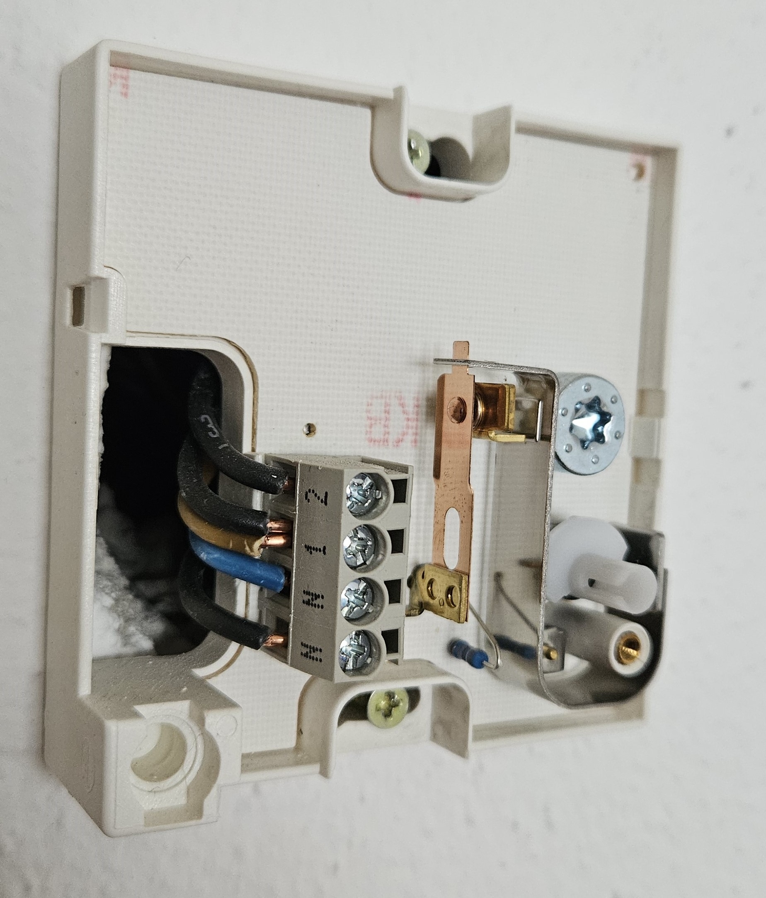
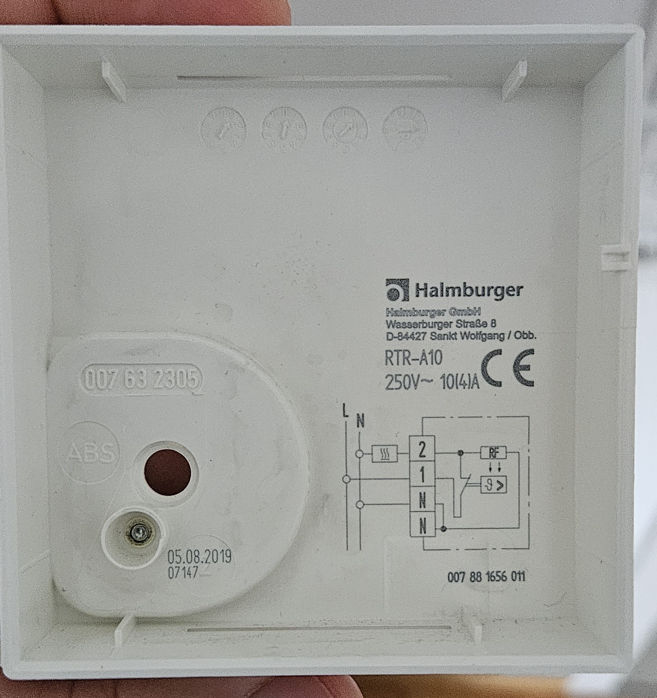
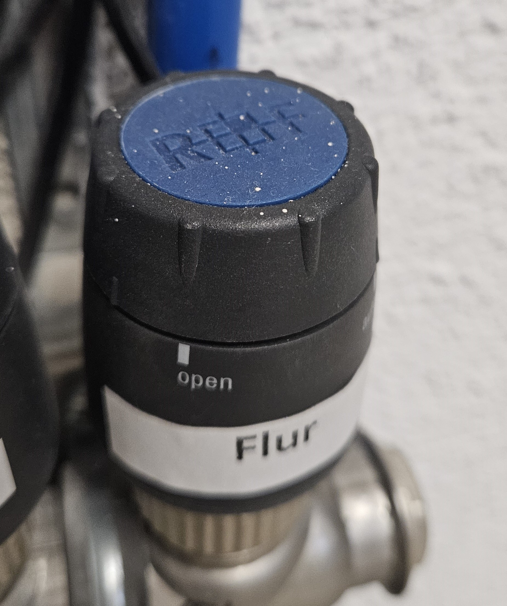
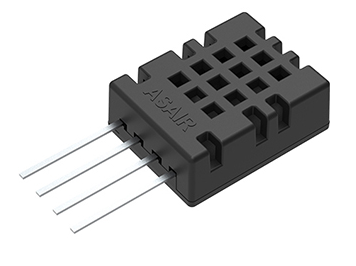
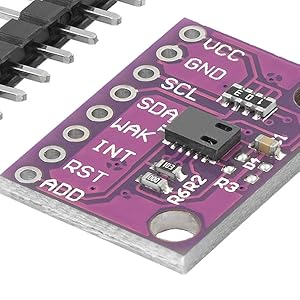
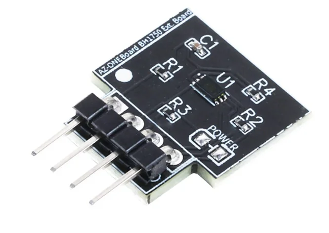
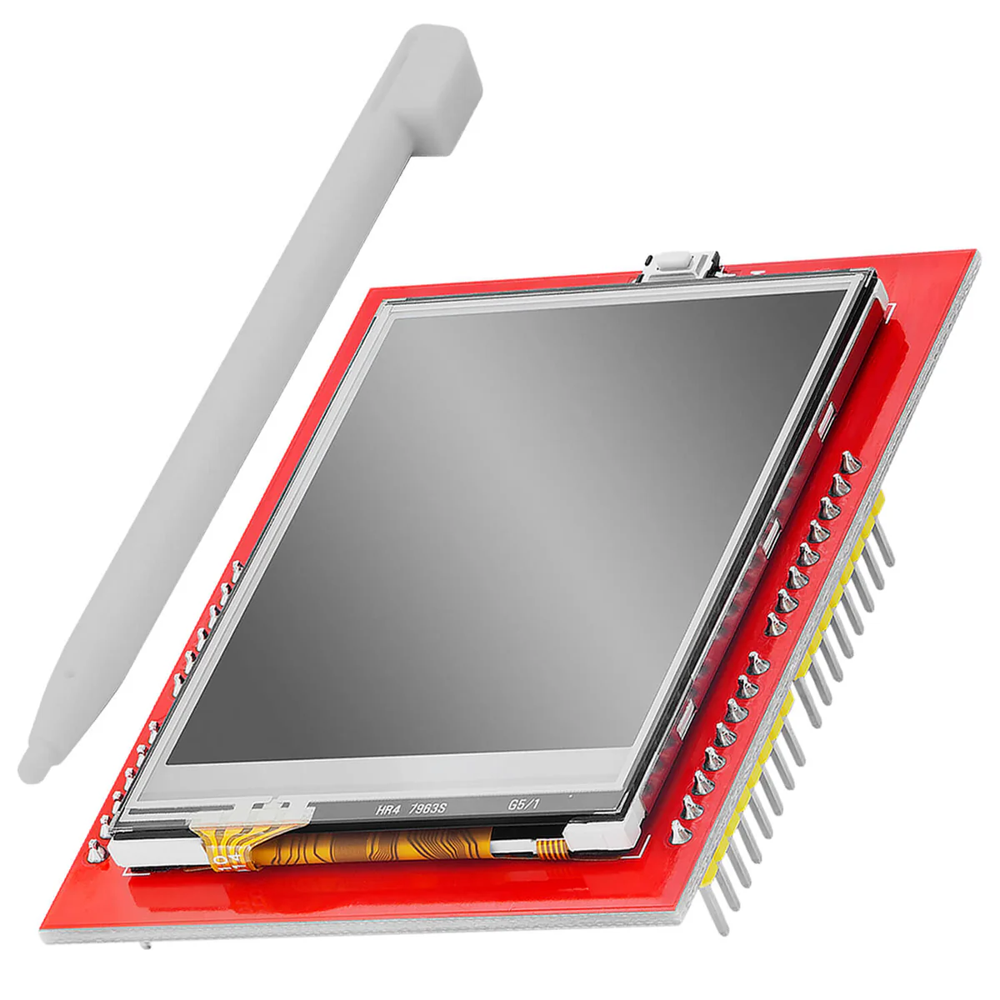
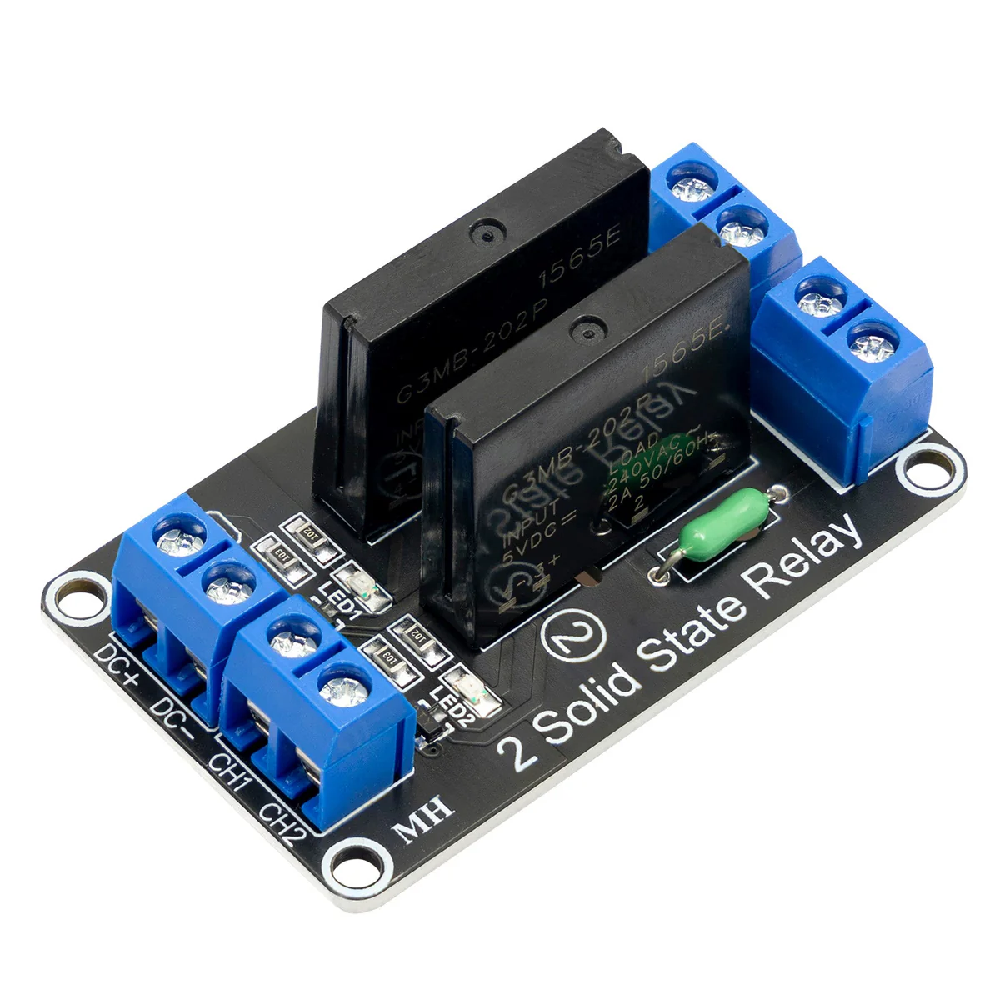

# Room Temperature Controller

> **Note:** This documentation is still under construction.

## Table of Contents

- [The Idea](#the-idea)
- [Current situation](#current-situation)
  - [Room Temperature Controller](#room-temperature-controller)
  - [Valve drive](#valve-drive)
- [Preliminary thoughts](#preliminary-thoughts)
  - [Hardware components](#hardware-components)
    - [Sensors](#sensors)
      - [Kind of sensor connection](#kind-of-sensor-connection)
      - [Temperature and Humidity Sensor](#temperature-and-humidity-sensor)
      - [CO2 Sensor](#co2-sensor)
      - [Brightness Sensor](#brightness-sensor)
    - [Display](#display)
    - [Relay](#relay)
    - [Buttons](#buttons)
    - [Controller](#controller)
    - [Power Supply](#power-supply)

## The Idea

The idea of this project is to develop a replacement for the existing mechanical room temperature controller. 
However, the new room temperature controller should be electronic and have the same function as the existing room temperature controller.

Additionally, the room temperature controller should have the following features:
- Adjustable temperature
- Automatic temperature control
- Touch display for showing information and controlling functions
- Network connectivity (WiFi)
- Web server for controlling the room temperature controller
- MQTT for communication with other devices
- Switching the valve via an SSR (Solid State Relay)
- Additional sensors for measuring the following values:
  - Temperature
  - Humidity
  - CO2 concentration
  - Brightness

The software should be written in C++ and run on an ESP32. Additionally, a 3D-printed case should be used.

## Current situation

### Room Temperature Controller

The current room temperature controller is a mechanical device from the company Halmburger, model RTR-A10.

The instruction manual can be found under the folder assets:
- [Instruction Manual](assets/Anleitung-RTR-A10-und-RTR-A13.pdf)
- [Circuit diagram](assets/Schaltplan-Temperaturregler-Fussbodenheizung.pdf)

### Valve drive

The valve drive is a mechanical device from the company Richter-Frenzel. The model is unknown.

In internet i found the following information about the valve, which is similar to the existing valve Link and it has the following technical electrical data:

- Operating voltage: 230 V (AC) + 10 %…- 10 %, 50/60 Hz
- Inrush current: < 250 mA for max. 300 ms
- Operating power: < 3 W

## Preliminary thoughts

### Hardware components

#### Sensors

##### Kind of sensor connection

It exists different kind of sensors, which can be connected to the ESP32.

Analog sensors can be connected via the ADC (Analog Digital Converter) pins. Digital sensors can be connected via the I2C or SPI interface.

The advantage of analog sensors is that they can be connected to any analog pin. The disadvantage is that only one sensor can be connected to one pin.

The advantage of digital sensors is that they can be connected to the same bus. This means that multiple sensors can be connected to the same bus. The disadvantage is that the sensors need an address to be addressed. This means that multiple sensors of the same type can be connected to the same bus, but they need to have different addresses.

In this project, i will use digital sensors, because of easier wiring and the possibility to connect multiple sensors to the same bus.

##### Temperature and Humidity Sensor

For measuring the temperature and humidity, the DHT20 sensor from the company ASAIR will be used. The sensor is connected via I2C. The sensor has a measurement range of -40 to 80 degrees Celsius and 0 to 100% relative humidity.

##### CO2 Sensor

For measuring the CO2 concentration, the CCS811 sensor will be used. The sensor is connected via I2C. The sensor has a measurement range of 400 to 8192 ppm. The sensor has an internal algorithm for calculating the CO2 concentration. The sensor also measures the TVOC (Total Volatile Organic Compounds) concentration. More information about the sensor can be found in the local documentation or on the website of the manufacturer.

Links:

- local documentation: [CCS811](assets/AZ363_D_14-10_DE_B0BN8V9PJV_a9e14072-22d6-4df1-897d-fb8e85ca8aa0.pdf)
- https://www.az-delivery.de/products/co2-gassensor-ccs811?variant=43961284002059

##### Brightness Sensor

For measuring the brightness, the BH1750 sensor will be used. This sensor is implemented on an extensionboard for AZ-ONEBoard from the company AZ-Delivery. The sensor is connected via I2C. The sensor has a measurement range of 0 to 65535 Lux. The sensor has a resolution of 1 Lux.

Links:

- local documentation: [BH1750](assets/AZ-Delivery_BH1750.pdf)
- https://www.az-delivery.de/products/az-oneboard?_pos=1&_sid=7f3b3b3f4&_ss=r

#### Display

As a display, a 2.4 inch TFT touch display will be used. The display is connected via SPI. The display has a resolution of 320x240 pixels. The display has a touch function, which can also be used for controlling the room temperature controller.

Links:

- local documentation: [2.4 inch TFT Touch Display](assets/AZ-Delivery_2_4_TFT_Touch_Display.pdf)
- https://www.az-delivery.de/products/2-4-tft-lcd-touch-display

#### Relay

Because of inrush current: < 250 mA for max. 300 ms, a Solid State Relay (SSR) can be used. The SSR has a switching capacity of 100-240V AC and 2 A. The SSR is connected via a digital pin.

Links:

- local documentation: [SSR](assets/AZ-Delivery_2-Kanal-Solid-State-Relais.pdf)
- https://www.az-delivery.de/products/2-kanal-solid-state-relais?_pos=2&_sid=7391349f9&_ss=r

#### Buttons

Optional buttons can be used for controlling the room temperature controller. The buttons could be connected via digital pins. But in the first step, the touch display will be used for controlling the room temperature controller.

#### Controller

As a controller, the ESP32 will be used. The ESP32 has a dual-core processor with a clock speed of 240 MHz.

The ESP32 has a built-in WiFi module, which can be used for connecting the room temperature controller to the network. 

The ESP32 has a built-in I2C and SPI interface, which can be used for connecting the sensors and the display. 

The ESP32 has a built-in ADC, which can be also used for connecting analog sensors. This can be a option for future extensions.

The ESP32 has a built-in DAC, which can be used for generating analog signals. This also can be a option for future extensions.

The ESP32 has a built-in EEPROM, which can be used for storing the configuration.

#### Power Supply

The given primary power supply is 230V AC. The power supply on the secondary site what we need is 5V DC and 3.3V DC:

- for the ESP32 is 5V DC
- for the display is 5V DC
- for the sensors is 3.3V DC
- for the SSR is 3.3V DC

Therefore, a power supply with 230V AC to 5V DC and 3.3V DC is needed. The power supply will be defined in the future, if the summary of the power consumption is known.
